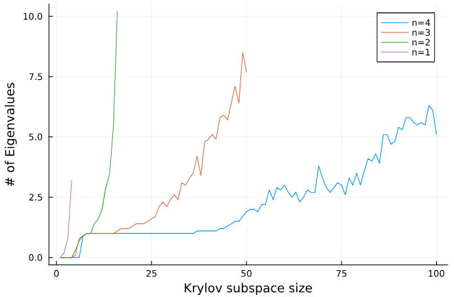

# Qutee.jl

> [!WARNING]  
> This is research software. Not all features are implemented or optimized. 

This code aims to achieve the following goals:
- Construction of quantum circuits as a quantum channel
- Riemannian optimization for quantum channel (circuit) optimization
- Conversion of quantum information forms (Kraus, Choi, Liouville, etc.)
- Automatic differentiation (AD)
- GPU support (with AD)
- Someday use [Enzyme](https://github.com/EnzymeAD/Enzyme) for AD
- And more?

## Installation

For now, this package is not registered. But you can use directly from Github. 

```julia
using Pkg
Pkg.add(url="https://github.com/RustyBamboo/Qutee.jl")
```
or
```julia
]
pkg> add https://github.com/RustyBamboo/Qutee.jl
```

## Examples

**Circuit Optimization**

```julia
using Qutee

# 2-qubit operation: Qubit reset and Identity
op = (QuantumInfo.R ⊗ [1 0; 0 1]) 

# A vector of random 2-qubit gates (4x4 unitary matrices)
rand_U = [reshape(QuantumInfo.rand_channel(Array,1,2^2), (2^2,2^2)) for _ in 1:3]

# Construction of the circuit
function circuit(U)
	C = mapreduce(x->op⊙x, ⊙, U)
	return C
end

# The loss function that we wish to optimize. You can compare to whatever matrix you want.
# For reference, here I use a simple example where we compare to the identity matrix.
function circuit_error(U)
    C = circuit(U)  # Creates a circuit from our matrix
	C_L = QuantumInfo.kraus2liou(C)  # Converts the circuit to a form we can work with
	return norm(C_L - I)  # Example loss function
end

# Optimize using gradient descent over the Stiefel Manifold
out_u, history_u = QuantumInfo.Optimization.optimize(rand_U, circuit_error, 500; η=0.2, decay_factor=0.9, decay_step=10)

```


**CUDA**

A small benchmark that compares CPU and CUDA in
1. Matrix-matrix multiplication
2. Finding the largest eigenpair via the [power method](https://en.wikipedia.org/wiki/Power_iteration) 

```julia
using LinearAlgebra, Pkg, Plots, BenchmarkTools, CUDA
using Qutee

function random_vector(K)
	n,m,_ = size(K)
	v = rand(n,m) + im * rand(n,m)
    v /= norm(v)
end

K_list = [QuantumInfo.rand_channel(CuArray,2,2^i) for i in 1:11]
v_list = [random_vector(K) for K in K_list]

cpu_times = [@elapsed K_list[i] * v_list[i] for i in 1:length(K_list)]
gpu_times = [CUDA.@elapsed cu(K_list[i]) * cu(v_list[i]) for i in 1:length(K_list)]
p1 = plot([cpu_times, gpu_times], labels=["CPU" "CUDA"], title="Matrix-Matrix Multiplication", xlabel="# of Qubits", ylabel="Time [s]", markershape=:xcross)
savefig(p1, "benchmark1.png")

cpu_times_power = [@elapsed QuantumInfo.power_method(K_list[i], v_list[i], 50) for i in 1:length(K_list)]
gpu_times_power = [@elapsed QuantumInfo.power_method(cu(K_list[i]), cu(v_list[i]), 50) for i in 1:length(K_list)]
p2 = plot([cpu_times_power, gpu_times_power], labels=["CPU" "CUDA"], title="Power Method (50 Iterations)", xlabel="# of Qubits", ylabel="Time [s]", markershape=:xcross)
savefig(p2, "benchmark2.png")
```


## Arnoldi Analysis
The following code uses the goodness function to assess how effective certain methods are at generating eigenvectors. We will use it to test how well the arnoldi method performs.

```julia
using Qutee


function goodness(standeig, testeig, m)
    vals = zeros(ComplexF64, 1, m)  # initializes array that will hold accuracy of each eigen pair
    count = 0
    for i in 1:m  # iterates through all eigen pairs
        # compares the last (largest) eigenvalues from standeig and testeig. The closer it is to 1, the more similar the pair is.
        vals[1, i] = standeig[:, end-i+1]' * testeig[:, end-i+1]
        if norm(vals[1, i]) > 0.99  # Change this number to whatever percent similarity/accuracy you desire
            count += 1
        end
    end
    return count
end

nn = 4  # number of qubits
cases = 10 # the number of test cases
comp = zeros((2^nn)^2,1)
for j in 1:cases
	En = QuantumInfo.rand_channel(Array, 3, 2^nn)  # Random channel in Kraus representation
	Ln = QuantumInfo.kraus2liou(En)  # Convert channel to a big matrix representation
	goal = rand((2^nn)^2)  # Random start vector for arnoldi

	vals, standeig = standardeigen(Ln)  # True eigenvalues to compare to
	for i in 1:(2^nn)^2
		testvals, testeig = arnoldi2eigen(Ln,goal,(2^nn)^2,i)  # For each iteration, find arnoldi eigenvalues
		comp[i,1] += goodness(standeig,testeig,i)  # Store number of matches
	end
end	
comp /= cases  # averages the results
for i in 1:(2^nn)^2  # prints result for easy copy + paste to store for later
	print(comp[i,1])
	print(", ")
end

# Plotting the results
```


By plotting the results, we can see that for any number of qubits, the first eigenvalue tends to be found fairly quickly (m < 10). However, finding any more than that takes significantly longer. Also, it is interesting how sporadic the number of eigenvalues found is.


## Contributors

- Daniel Volya
- Andrey Nikitin